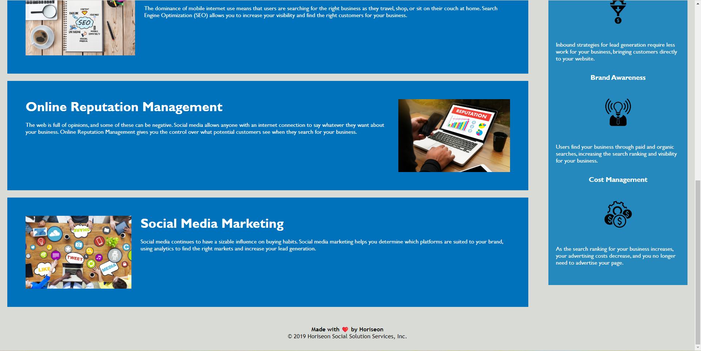

# CHALLENGE01-Horiseon-accessibility-refactor
This repository contains files used to refactor the Horiseon website code to make it more accessible

## Description

This project depicts a Marketing Agency's website. It highlights the services they provide and certain benefits that users will receive by using these services.

A key part of creating the project involved refactoring the files to ensure the codebase follows accessibility standards and therefore is optimised for search engines. During this process I learned that certain elements such as semantic HTML elements, alt text in images and short descriptive titles all improve accessibility for users who require assistance in navigating and interacting with the web.

## Installation

N/A

## Usage

To use this website, you can navigate the pages using the links in the nav bar or scroll down to review the content on the homepage.

## Credits

N/A

## License

Please refer to the LICENSE in the repo.

## Link

https://github.com/francescasnatt/CHALLENGE01-Horiseon-accessibility-refactor.git